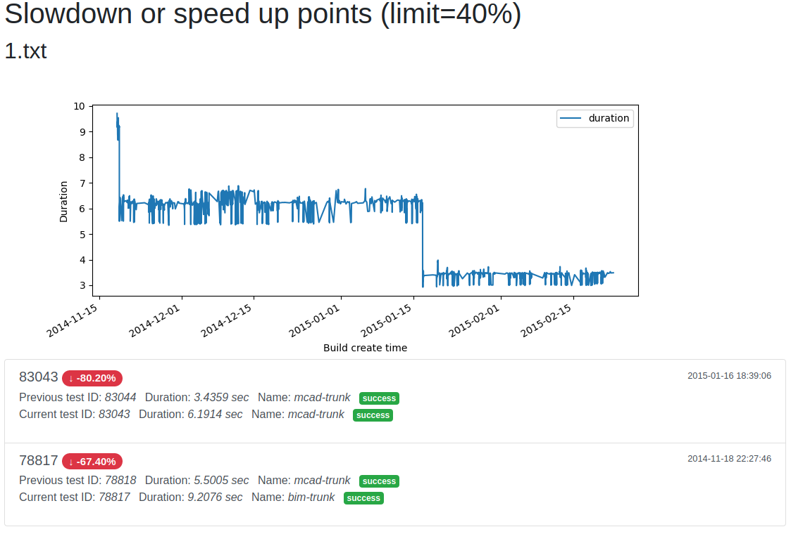

# Installation guide

Install Git using manuals:

- Getting Started - [Installing Git](https://git-scm.com/book/en/v2/Getting-Started-Installing-Git)
- Install Git - [Install Git on Mac OS X](https://www.atlassian.com/git/tutorials/install-git#mac-os-x) / [Install Git on Windows](https://www.atlassian.com/git/tutorials/install-git#windows) / [Install Git on Linux](https://www.atlassian.com/git/tutorials/install-git#linux)
- or [any other manual](https://www.google.com/search?q=install+git)

Clone this project from GitHub.

```
https://github.com/leonov-sergey-s/test-bricsys-devops ~/test-bricsys-devops
```

## Install Docker

- Install [Docker CE](https://docs.docker.com/install/)
- Install [Docker Compose](https://docs.docker.com/compose/install/)

## Deploy docker-images

```bash
docker pull mysql:8.0.20
docker pull sergeyl4v/test-bricsys-devops:latest
```
## Run

Run docker-compose from project root directory:

```bash
cd ~/test-bricsys-devops
docker-compose down && docker-compose up
```

or run startup script:

```bash
cd ~/test-bricsys-devops
sh start.sh
```

First start is long process. Please wait.

## Results

Command for connect to MySQL server:

```bash
cd ~/test-bricsys-devops
docker-compose exec db mysql -utestBricsysDevOps -DtestBricsysDevOps -ptestSecurePassword
```
or 
 
```
mysql -h localhost  -P 33061 --protocol=tcp -utestBricsysDevOps -DtestBricsysDevOps -ptestSecurePassword
```

After this you can view database use sql-queries. Example:

```mysql

mysql> show tables;
+-----------------------------+
| Tables_in_testBricsysDevOps |
+-----------------------------+
| testresults                 |
| testresults_points          |
+-----------------------------+
2 rows in set (0.01 sec)

```


## To view visualization of result

Open http://localhost:5000 in your browser.



## Stop 

To stop process in terminal press CTRL+C. 
After this:   

```bash
cd ~/test-bricsys-devops
docker-compose down
```

